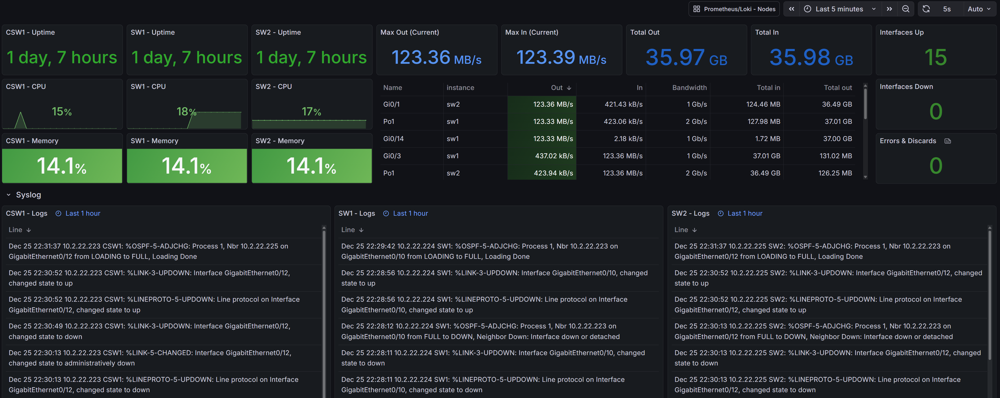
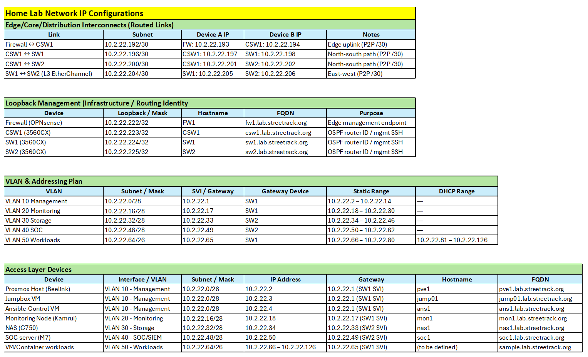
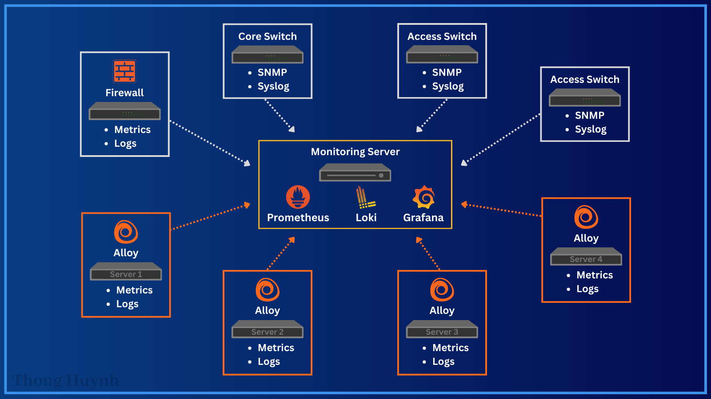
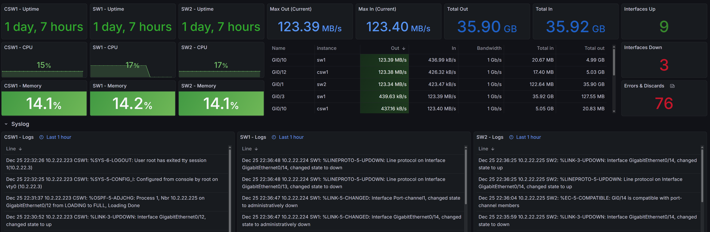
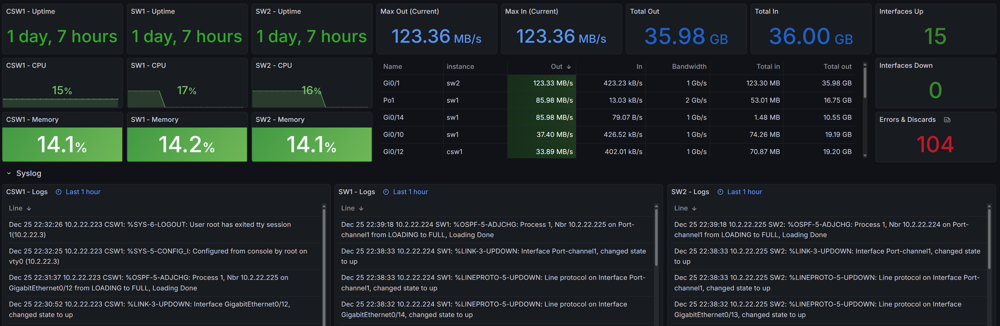

# Mon1theus: An Enterprise Observability Platform



Mon1theus is a centralized monitoring and observability stack built to support a **Layer 3 routed homelab environment**. It provides metrics, logs, and alerts across Linux hosts, network infrastructure, and perimeter services using an Ansible-driven deployment model.

This project reflects how monitoring is typically introduced and operated in a small-to-mid sized infrastructure environment rather than a single-host demo setup.


## Design Goals

* Centralize **metrics and logs** from infrastructure and workloads
* Support a **fully routed campus-style network**
* Monitor **network devices and servers using appropriate protocols**
* Keep deployment **repeatable, auditable, and idempotent**
* Avoid tightly coupling services to a single operating system or distribution


## Network & Topology Context



The monitoring stack operates within a **collapsed-core Layer 3 network**:

* Three Layer 3 switches (core + access)
* Routed inter-switch links using OSPF
* VLANs hosted only at the access layer
* Loopback interfaces used for:

  * Management
  * SNMP targets
  * Stable monitoring identities
* No Layer 2 trunking between switches

This design intentionally mirrors modern routed campus and data center access models and avoids spanning-tree dependencies.


## Monitoring Architecture



### Central Monitoring Node

A dedicated monitoring host (`mon1`) acts as the aggregation point for all telemetry:

* Metrics ingestion
* Log aggregation
* Alert evaluation
* Visualization

### Telemetry Flow

**Metrics**

* Linux hosts expose metrics via Node Exporter
* Network devices are monitored via SNMP
* Prometheus handles scraping, evaluation, and alerting

**Logs**

* Hosts and network devices forward logs via syslog
* rsyslog normalizes and separates logs per source
* Grafana Alloy forwards logs into Loki
* Loki serves as the centralized log store

This separation allows metrics and logs to scale independently.


## Components

| Component     | Role                                    |
| ------------- | --------------------------------------- |
| Prometheus    | Metrics collection and alert evaluation |
| Node Exporter | Linux host metrics                      |
| SNMP Exporter | Network device metrics                  |
| Grafana Alloy | Unified telemetry agent                 |
| Loki          | Log aggregation                         |
| Grafana       | Visualization and dashboards            |
| Alertmanager  | Alert routing                           |


## Inventory & Scope

The inventory separates **monitoring core services** from **monitored clients**:

* `mon_core`: Hosts responsible for infrastructure telemetry (SNMP, syslog)
* `mon_clients`: Hosts providing system-level telemetry

This separation allows different collection strategies without duplicating logic across hosts.


## Ansible Implementation Notes

* Role-based structure with group-scoped variables
* Services can be deployed independently
* SELinux and firewalld rules are managed explicitly
* Cross-distro handling for log collection (journald vs file-based)
* Configuration templates are version-controlled

This mirrors how configuration management is typically applied in mixed Linux environments.


## SNMP Monitoring Strategy

* SNMP exporter runs locally on the monitoring node
* Network devices are polled using loopback addresses
* Interface and device metrics are collected separately
* Relabeling is used to apply human-readable device names
* OID mappings are templated to allow future extension

This approach keeps SNMP traffic localized and avoids distributing exporter processes across network devices.


## Dashboards

Grafana dashboards are provided as JSON definitions and include:

* Host-level resource utilization
* Network interface throughput
* Device health and availability
* Centralized log views

Dashboards are treated as configuration artifacts rather than UI-only objects.


## Deployment

Deployment is performed using Ansible playbooks, allowing selective rollout:

```bash
ansible-playbook playbooks/prometheus.yaml
ansible-playbook playbooks/loki.yaml
ansible-playbook playbooks/alloy.yaml
ansible-playbook playbooks/grafana.yaml
ansible-playbook playbooks/snmp_exporter.yaml
```

Each component can be installed or updated independently.


## Validation & Operations

After deployment:

* Prometheus confirms scrape health 
* Grafana dashboards verify metric and log ingestion
* SNMP metrics confirm network device visibility
* Syslog files confirm correct routing and labeling

Operational validation focuses on data integrity rather than service status alone.

### Failover and Event Validation



<div align=center>
   <em>
      During an active load test, the Layer 3 EtherChannel between access switches was intentionally taken offline to simulate a link failure.
   </em>
</div>
<br>

Observed behavior:
  * The EtherChannel interfaces transitioned to a down state
  * OSPF reconverged and rerouted traffic northbound through the core switch (`CSW1`)
  * Interface-down counters increased as expected
  * Traffic throughput remained stable, confirming successful rerouting
  * Metrics and syslog ingestion continued without interruption

This confirms that the routed design properly absorbs link failures without service impact and that monitoring remains accurate during topology changes.

<br>



<div align=center>
   <em>
      After restoring the EtherChannel, traffic automatically rebalanced across the access layer.
   </em>
</div>
<br>

Observed behavior:
  * Interfaces returned to an up state
  * OSPF adjacencies were re-established
  * Traffic shifted back to the original east–west path through `SW1` and `SW2`
  * Interface-down counters returned to zero
  * Error and discard counters reflected only the earlier unplug events
  * No lingering routing instability was observed

This validates correct OSPF convergence, clean recovery behavior, and accurate post-failure telemetry.

> **Operational Insight:** Telemetry accurately reflects real network behavior during failure and recovery, making the platform reliable for troubleshooting and incident response.


## Future Work

* High-availability Prometheus
* External alert receivers
* Grafana provisioning automation
* Long-term metrics storage backend
* TLS and authentication between components


## Summary

Mon1theus demonstrates how monitoring is designed, deployed, and operated in a routed infrastructure environment using practical tooling and realistic assumptions. The focus is on **architecture, maintainability, and operational clarity** rather than one-click deployment.


